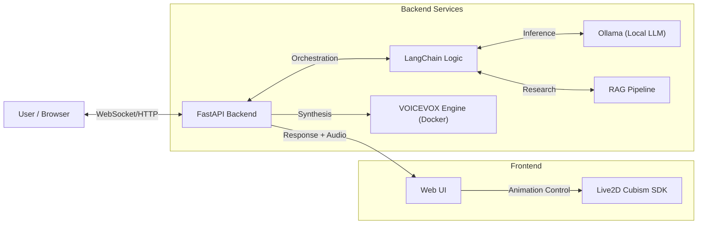

# 🌙 Live2D Chatbot (Tsukuyomi-chan)

A cute, interactive, and intelligent virtual desktop companion powered by local AI technologies. **Tsukuyomi-chan** combines expressive Live2D animation, natural Japanese voice synthesis, and local LLM intelligence into a unified chatbot experience.

## ✨ Features

  * **💬 Interactive Personality**: Engages in conversation with emotional awareness and expressive Live2D animations.
  * **🧠 Local Intelligence**: Powered by **Ollama** & **LangChain**, keeping your data private and offline.
  * **🗣️ Natural Voice**: Uses **VOICEVOX** for high-quality, character-specific Japanese text-to-speech (TTS).
  * **📚 RAG Capabilities**: Capable of conducting research and generating reports based on web searches (Retrieval-Augmented Generation).
  * **🎀 Modern UI**: A clean, floating web interface with animated backgrounds and glassmorphism design.
  * **⚡ Fully Offline**: Once set up, the system runs entirely on your local machine without external API dependencies.

## 🏗️ System Architecture



## 📋 Prerequisites

Before you begin, ensure you have the following installed:

  * **Python 3.10+**
  * **Docker Desktop** (Required for VOICEVOX)
  * **Git**
  * **Hardware**: A GPU is recommended for smoother LLM inference and TTS generation.

## 🚀 Installation & Setup

### 1\. Install & Configure Ollama

Ollama handles the Large Language Model inference.

1.  Download and install Ollama from [ollama.com](https://ollama.com/download).
2.  Pull the required model (default is `ministral-3:3B` and `gemma3`):
    ```bash
    ollama pull ministral-3:3b
    # AND
    ollama pull gemma3
    ```

### 2\. Set up VOICEVOX (TTS Engine)

We use Docker to run the VOICEVOX engine locally.

  * **For Linux / MacOS:**

    ```bash
    docker run -d --name voicevox_engine -p 50021:50021 voicevox/voicevox_engine
    ```

  * **For Windows (with NVIDIA GPU acceleration):**

    ```bash
    docker pull voicevox/voicevox_engine:nvidia-latest
    docker run --rm --gpus all -p 50021:50021 voicevox/voicevox_engine:nvidia-latest
    ```

    *(Note: If you don't have an NVIDIA GPU, use the Linux command without GPU flags.)*

### 3\. Application Setup

Clone the repository and install dependencies. It is recommended to use a virtual environment.

```bash
# Clone the repo
git clone https://github.com/your-username/live2d-chatbot.git
cd live2d-chatbot

# Create virtual environment (Optional but recommended)
python -m venv venv
# Windows:
.\venv\Scripts\activate
# Linux/Mac:
source venv/bin/activate

# Install dependencies
pip install -r requirements.txt
```

### 4\. Configuration (Optional)

Check `config.py` to customize settings such as:

  * `CHAT_MODEL`: The Ollama model to use.
  * `VOICEVOX_URL`: URL of the TTS engine (default: `http://localhost:50021`).
  * `TAVILY_API_KEY`: Required if you want to use the online research feature.

## ▶️ Usage

Start the backend server. This will serve both the API and the Frontend.

```bash
# Run using the wrapper script
python run.py

# OR run with uvicorn directly
uvicorn app:app --host 127.0.0.1 --port 5000 --reload
```

Once started, open your browser and visit:
👉 **[http://127.0.0.1:5000](https://www.google.com/search?q=http://127.0.0.1:5000)**

## 🎭 Emotion Tags

The LLM is prompted to include emotion tags in its response to trigger Live2D expressions.

| Tag | Expression | Description |
| :--- | :--- | :--- |
| `[emotion:joy]` | Happy / Laugh | Positive feedback or excitement |
| `[emotion:sad]` | Sad / Tear | Empathy or sorrow |
| `[emotion:angry]` | Angry | Frustration or annoyance |
| `[emotion:neutral]`| Calm | Standard idle state |
| `[emotion:cute]` | Winking / Playful | Flirty or cute behavior |
| `[emotion:shy]` | Blush | Bashfulness or embarrassment |

## ⚖️ Legal & Terms of Use

Please strictly adhere to the following licenses regarding the assets used in this project:

1.  **Project Code**: Released under the **MIT License**.
2.  **VOICEVOX**:
      * This project uses the free version of VOICEVOX.
      * Terms: [https://voicevox.hiroshiba.jp/](https://voicevox.hiroshiba.jp/)
      * *Note: While commercial use is permitted by VOICEVOX, you must credit them in any generated audio.*
3.  **Live2D Models**:
      * The sample models (e.g., Hiyori) are property of Live2D Inc.
      * **Strictly for non-commercial, personal learning, or academic research only.**
      * Terms: [Live2D Sample Model Terms](https://www.live2d.com/eula/live2d-sample-model-terms_en.html)

> **Disclaimer**: This project is intended for educational purposes. The developers are not responsible for any misuse of the generated content or violation of the third-party asset licenses.